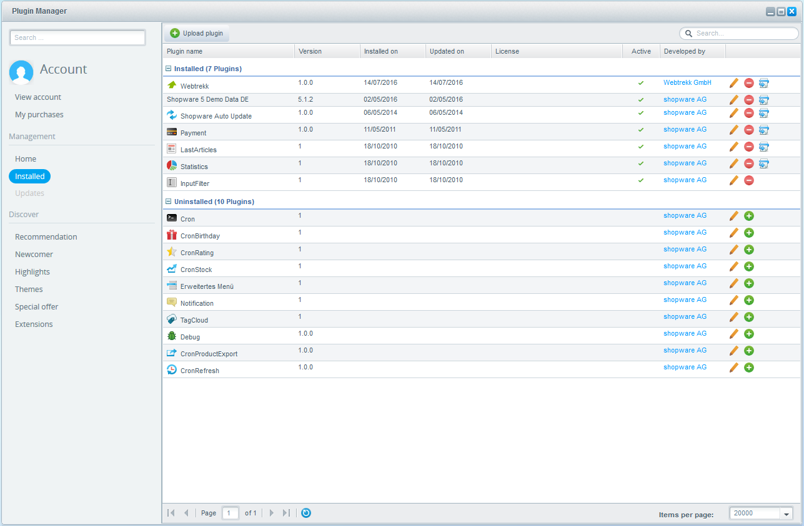
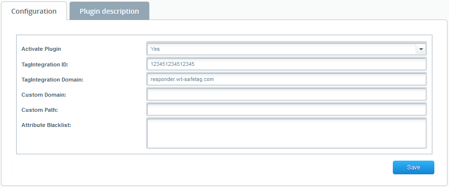

Integration und Konfiguration des Webtrekk Shopware Plugin | Version $version$

# Einführung

Das Webtrekk Shopware Plugin ermöglicht Ihnen eine einfache Integration des Webtrekk Pixels in Ihre mit Shopware 
verwaltete Webseite. Jede Seite des Webangebots wird mit dem Webtrekk-Pixelcode (in der Version 4) versehen. Auf diese 
Weise werden alle Standardparameter erfasst.

Folgende Auswertungen sind damit möglich:

- Trafficanalysen (inkl. Ausweisung von (Neu-, \& Stamm-)Besuchern)
- ECommerce Analysen (inkl. Produkt- und Bestellauswertungen, allerdings ohne individuelle Konfigurationen)
- Standard-Marketinganalysen, d.h. automatisch erkennbare Nutzerherkunft wie SEO, Direkt oder Referrer (ohne Ausweisung individueller Kampagnen)
- Seitenanalysen (inkl. Heatmap)
- Aktionsanalysen
- Formularanalysen

Entwickelt wurde das Plugin für Shopware 5.0 - 5.2.1 in Kombination mit dem Webtrekk Pixel in der Version 4. (D.h. 
zusätzlich zu dem Shopware Plugin benötigen Sie eine entsprechende JS-Datei des Pixels und einen Webtrekk 
TagIntegration Account)

Dieses Dokument gibt eine Übersicht über die gesetzten Werte auf den Einzelseiten und beschreibt die Einbindung des 
plugin in Ihr System.

# Shopware Plugin

## Funktionsweise

Die Erweiterung übernimmt für Sie die Erstellung eines Pixelkonzepts. Anhand der in Shopware gesetzten 
Produktinformation werden die Webtrekk-Pixelparameter automatisch befüllt.

Die Generierung dieser Parameterwerte (z.B. die Erstellung der Seitennamen) erfolgt mit Hilfe vordefinierter 
Algorithmen.

Einige Funktionen wie das Aktions-, Heatmap- und Formulartracking können von Ihnen selbst auf jeder Einzelseite, über 
Webtrekk TagIntegration, nach Bedarf aktiviert bzw. deaktiviert werden.

## Installation

Um die Installation des Plugins zu beginnen, loggen Sie sich bitte bei Ihren Shopware Account ein. Importieren Sie die 
Extension über "Configuration \> Plugin Manager \> Management \> Installed". Laden Sie nun das Plugin unter "Upload 
plugin" hoch und installieren es über das "+" Symbol. Anschließend können Sie das Plugin aktivieren.



## Konfiguration

Nachdem installieren des Plugins, öffnet sich eine Konfigurationsmaske, in der Sie die Basiskonfiguration hinterlegen 
könne.



- **Activate Plugin:** Hier können Sie das Webtrekk Plugin zusätzlich aktivieren bzw. deaktivieren
- **Webtrekk JavaScript file:** Hier können Sie den Pfad zur Webtrekk JavaScript Datei eintragen (/webtrekk_v4.min.js)
- **Async:** Legt fest, ob der TagIntegration-Container asynchron geladen werden soll
- **TagIntegration ID:** Tragen Sie hier Ihre TagIntegration Kunden-ID ein, wenn die TagIntegration Datei vom Webtrekk Server geladen werden soll
- **TagIntegration Domain:** Tragen Sie hier die TagIntegration Domain ein, wenn die TagIntegration Datei vom Webtrekk Server geladen werden soll
- **Custom Domain:** Tragen Sie hier Ihre Domain ein, wenn die TagIntegration Datei von Ihrem Server geladen werden soll
- **Custom Path:** Tragen Sie hier den Pfad zur JavaScript Datei ein, wenn die TagIntegration Datei von Ihrem Server geladen werden soll
- **Attribute Blacklist::** Hier können Sie eine semikolonseparierte Liste aller Attribute im Webtrekk DataLayer definieren, welche Sie herausfiltern möchten. Dies ist Beispielsweise für die speziellen Attribute "userData_\*", "billing_\*" und "shipping_\*" nötig, wenn Sie diese nicht im DataLayer haben möchten.

# Generierung der Parameterwerte

Basis einer Webtrekk Implementierung ist die Benennung der Seiten. Shopware Seiten lassen sich grob in Produktseiten 
(Produktdetailansichten und Produktkategorieseiten) und separate "Spezialseiten" untergliedern. Das Plugin setzt 
diese sogenannten ContentIds (entspricht dem Seitennamen) stets aus diesen Werten sowie dem Seitentitel zusammen:

```example
[language].[Hierarchie1].[ Hierarchie2].[Seitentitel]
```

Um Seitenhierarchieebenen auch übergewertet auswerten zu können, werden die Werte als sogenannte Contentgruppen 
übermittelt. 

Zusätzlich wird jede Seiten in spezielle Bereiche aufgeteilt. In der unteren Tabelle finden Sie eine Übersicht welche 
Typen gesetzt werden.

| Seite | Wert |
| ------ | ------ |
| CMS Seiten | "Editorial content" |
| Blogseiten | "Blog content"|
| Produktdetailseiten | "Product details" |
| Kategorieseiten | "Category page" |
| Suchergebnisseite | "Search page" |
| Accountbereich | "Account" |
| Kontaktseiten | "Contactform" |
| Newsletterseiten | "Newsletter" |
| Checkout | "Buying process" |

Diese Seiten werden in Abhängigkeit des jeweiligen Seitentyps mit weiteren Parametern angereichert. Diese 
bestehen aus den entsprechenden Shopware-Feldern entnommen.

Hier eine Übersicht über die eingesetzten Parameter:

| Parameter | Beschreibung | Seiten mit dem Parameter |
| ------ | ------ | ------ |
| ContentId | Seitenname; Grundlage des Trackings | Alle Seiten |
| Contentgruppen | Inhaltliche Gliederung der Webseite anhand Ihrer Produktkategorisierung oder deren sonstiger Funktionalität | Alle Seiten (außer der Startseite) |
| Produkt | SKU eines Produkts | Produktansichten, Hinzufügen in den Warenkorb, Bestellbetätigungsseite |
| Produktanzahl | Anzahl der hinzugefügten/bestellten Produkten | Hinzufügen in den Warenkorb, Bestellbetätigungsseite |
| Produktkategorien | Gliederung der Produkte in deren hierarchische Kategorien | Alle Seiten mit Informationen zu einzelnen Produkten (z.B. Produktdetailseiten/Bestellbestätigungsseiten) |
| Produktstatus | Ergänzt das Produkt um den momentanen Status: "view", "add" oder "conf" | Produktansichten, Hinzufügen in den Warenkorb, Bestellbetätigungsseite |
| Bestell-ID | Bestellnummer beim Abschluss einer Bestellung | Bestellbestätigungsseite |
| Bestellwert | Wert einer Bestellung | Bestellbestätigungsseite |
| Bezahlmethode | Bezahlmethode | Bestellbestätigungsseite |
| Versandmethode | Versandmethode | Bestellbestätigungsseite |
| Interne Suchbegriffe | Auf Ihrer Webseite ausgeführte Suchen | Suchergebnisseite |
| Seitenparameter (SP Suchtreffer) | Anzahl der Suchtreffer | Suchergebnisseite |
| Customer ID | Ihre Interne Nutzer ID | Sobald der Nutzer eingeloggt ist |

Folgende Tabelle enthält beispielhaft eine Seite pro Typ mit den jeweils gesetzten Werten. Diese Werte werden 
automatisch in einen TagIntegration DataLayer geschrieben. Diese Werte können Sie dann im TagIntegration als Parameter 
anlegen und dem Webtrekk Tracking Plugin zuweisen. 

```js
// Beispiel eines DataLayers auf der Produktdetailseite:

window._ti = {
    "pageLanguage": "en",
	"productId": "SW10159",
	"productName": "YORK 3",
	"productPrice": "599",
	"productQuantity": "1",
	"currency": "EUR",
	"productStatus": "view",
    "instock": "12",
    "isAvailable": "1",
    "currency": "EUR",
    "productCat_1_1": "Handwerk & Tradition",
    "productCat_1_2": "Herren",
    "productCat_1_3": "Businesstaschen",
    "productCat_Canonical_1": "Handwerk & Tradition",
    "productCat_Canonical_2": "Herren",
    "productCat_Canonical_3": "Businesstaschen",
    "pageType": "Product details",
    "pageId": "de.handwerk & tradition.herren.sw10159"
};
```

In der Spalte "Fest" sind alle Parameter markiert, die immer den gleichen Wert enthalten. Der Wert wird dabei
immer in Englisch übergeben. Bei allen markierten Parameter unter "Dynamisch" wird der übergebene Wert
entsprechend dynamisch bestimmt.

| Seite | TagIntegration DataLayer | Beispiel | Fest | Dynamisch |
| ------ | ------ | ------ | :----: | :----: |
| Kategorieseiten | pageId | en.adventure.equipment | nein | ja |
|  | pageType | Category page | ja | nein |
|  | pageCat_1 | Adventure | nein | ja |
|  | pageCat_2 | Equipment | nein | ja |
| Warenkorbseite | pageId | en.checkout.cart | nein | ja |
|  | pageType | Buying process | ja | nein |
| Produkt ansehen | pageId | de.adventure.equipment.snowboard.sw100391 | nein | ja |
|  | pageType | Product details | ja | nein |
|  | productId | SW10039.1 | nein | ja |
|  | productName | Pocketknife | nein | ja |
|  | productCat_1_1 | Adventure | nein | ja |
|  | productCat_1_2 | Equipment | nein | ja |
|  | productCat_1_3 | Snowboard | nein | ja |
|  | productPrice | 399 | nein | ja |
|  | productQuantity | 1 | nein | ja |
|  | productStatus | view | ja | nein |
|  | currency | EUR | nein | ja |
|  | instock | 12 | nein | ja |
|  | isAvailable | 1 | nein | ja |
| Produkt in den Warenkorb legen | pageId | de.adventure.equipment.snowboard.sw100391 | nein | ja |
|  | pageType | Product details | ja | nein |
|  | productId | SW10039.1 | nein | ja |
|  | productName | Pocketknife | nein | ja |
|  | productCat_1_1 | Adventure | nein | ja |
|  | productCat_1_2 | Equipment | nein | ja |
|  | productCat_1_3 | Snowboard | nein | ja |
|  | productPrice | 399 | nein | ja |
|  | productQuantity | 1 | nein | ja |
|  | productStatus | add | ja | nein |
|  | currency | EUR | nein | ja |
|  | instock | 12 | nein | ja |
|  | isAvailable | 1 | nein | ja |
| Bestell – Bestätigungsseite | pageId | en.checkout.finish | ja | nein |
|  | pageType | Buying process | ja | nein |
|  | orderId | 20001 | nein | ja |
|  | orderValue | 14.90 | nein | ja |
|  | productId | SW10120;SW10119 | nein | ja |
|  | productName | product 1;product 2 | nein | ja |
|  | productQuantity | 1;1 | nein | ja |
|  | productPrice | 6;5 | nein | ja |
|  | currency | EUR | nein | ja |
|  | paymentName | Mastercard | nein | ja |
|  | deliveryName | Standard-Service | nein | ja |
|  | productStatus | conf | ja | nein |
| Login Seite | pageId | de.login | ja | nein |
|  | pageType | Account | ja | nein |
| Accountbereich | pageId | en.login.overview | ja | nein |
|  | pageType | Account | ja | nein |
| Interne Suche | pageId | en.search | ja | nein |
|  | pageType | Search page | ja | nein |
|  | internalSearch | snowboard | nein | ja |
|  | numberSearchResults | 24 | nein | ja |
| Informationsseite | pageId | en.about us | nein | ja |
|  | pageType | Editorial content | ja | nein |
| Eingeloggter User | userId | ef8ca1c0ff7d2e34dc0953d4222655b8 | nein | ja |
|  | isLoggedIn | 1 | nein | ja |

# Aktivierung von Trackingfunktionen

Das Tracking kann durch die Erfassung von Heatmap-, Formular-, Aktionendaten erweitert werden. Alle diese Funktionen 
können Sie im TagIntegration für alle oder einzelne Seiten aktivieren oder deaktivieren.

- **Aktionstracking:** Misst die Klick auf Interne Links. Als Aktionsname wird die Ziels-URL des jeweiligen Links verwendet
- **Heatmap:** Graphische Analyse, die mit Hilfe von Koordinatenangaben anzeigt wohin die Nutzer klicken
- **Formalure:** Ermöglicht die Auswertung ihrer Formulare

# Parameter Konfiguration

Einige der durch das Plugin erfassten Parameter sind in Webtrekk standardmäßig nicht konfiguriert. Diese
müssen vor Beginn der Datenerfassung eingerichtet werden.

Die Einrichtung erfolgt in Ihrem Webtrekk-Account unter "Konfiguration – Kategorisierung" bzw. "Konfiguration – Eigene 
Parameter".

| Tool Parameter | Kategorie ID | Empfohlene Benennung | Datentyp |
| ------ | :----: | ------ | :----: |
| Contentgruppen | 1 | CG - Navigationslevel 1 | Text |
|  | 2 | CG - Navigationslevel 2 | Text |
|  | 3 | CG - Navigationslevel 2 | Text |
|  | 4 | CG - Navigationslevel 2 | Text |
|  | 5 | CG - Navigationslevel 2 | Text |
| Produktkategorien | 1 | PC – Produkthierarchie 1 | Text |
|  | 2 | PC – Produkthierarchie 2 | Text |
|  | 3 | PC – Produkthierarchie 3 | Text |
|  | 4 | PC – Produkthierarchie 4 | Text |
|  | 5 | PC – Produkthierarchie 5 | Text |
| E-Commerce Parameter | 761 | EP - Bezahlmethode | Text |
|  | 762 | EP - Versandmethode | Text |
| Seitenparameter | 771 | SP - Suchtreffer | Zahl |

```info
Hinweis: Zur Freischaltung der vordefinierten Parameter, wenden Sie sich bitte an das Webtrekk Support-Team.
```

# Kontakt

Wenn Sie Fragen zur Einrichtung haben sollten, stehen wir Ihnen selbstverständlich zur Verfügung. Für priorisierten 
Support oder umfassendere Beratung bietet Webtrekk Support- und Consultingpakete an. Sprechen Sie uns an, wir 
unterbreiten Ihnen gerne ein individuelles Angebot.

Webtrekk GmbH   
Robert-Koch-Platz 4   
10115 Berlin

fon 030 - 755 415 - 0   
fax 030 - 755 415 - 100   
support@webtrekk.com

[www.webtrekk.com](https://www.webtrekk.com)