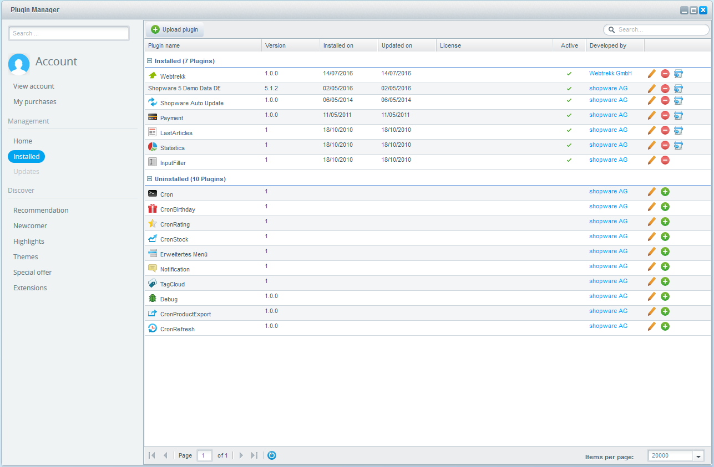

Integration and Configuration of the Webtrekk Shopware Plugin | Version $version$

# Introduction

The Webtrekk Shopware plugin enables you to integrate the Webtrekk pixel into your Shopware online shop simply and 
quickly. In the process, the Webtrekk pixel code (Version 4) will be added to each page of your shop. This, in turn, 
ensures all standard parameters are configured.

The following analyses will then be possible:

- Traffic analyses (incl. identification of (new \& regular) visitors)
- E-commerce analyses (incl. product and order analyses, without any individual configuration options, however)
- Standard marketing analyses, i.e. automatic recognition of user origin, such as SEO, direct or referrer (without identification of the individual campaigns)
- Page analyses (incl. heatmaps)
- Action analyses
- Form analyses

The plugin was developed for Shopware 5.0 - 5.2.1 in combination with the Webtrekk pixel version 4. (i.e. you will need 
the corresponding pixel JS file and Webtrekk TagIntegration account in addition to the Shopware plugin).

This document provides an overview of the values set on the individual pages and explains the integration of the 
plugin into your Shopware system.

# Shopware Plugin

## How it Works

The plugin handles the creation of a pixel concept for you. The Webtrekk pixel parameters are configured 
automatically based on the product information in Shopware.

The generation of these parameter values (e.g. creation of the page names) is completed with the help of predefined 
algorithms.

Some of the functions, such as the action, heatmap and form tracking functions, can be activated or deactivated 
manually on each page based on your individual requirements.

## Installation

To install the plugin, first login into your shopware account. Then go to "Configuration \> Plugin Manager \> 
Management \> Installed", upload and install the plugin by clicking the "+" symbol. Activate the plugin afterwards.



## Configuration

A form for the basic configuration should appear, after installing the plugin.


- **Activate Plugin:** Here you can activate and deactivate the webtrekk plugin.
- **Webtrekk JavaScript file:** The URL to the JavaScript which contains the tracking code (/webtrekk_v4.min.js).
- **Async:** Defines whether the TagIntegration container should be loaded asynchronously.
- **TagIntegration ID:** Enter your TagIntegration customer ID here, if the TagIntegration file should be loaded from a Webtrekk server.
- **TagIntegration Domain:** Enter the TagIntegration domain here, if the TagIntegration file should be loaded from a Webtrekk server.
- **Custom Domain:** Enter your domain here, if the TagIntegration file should be loaded from your server.
- **Custom Path:** Enter the path to your JavaScript file here, if the TagIntegration file should be loaded from your server.
- **Attribute Blacklist::** You can put here a list of all attributes that should be filtered out of the data layer, separated by semicolon. For example you can exclude the following attributes like this "userData_\*", "billing_\*" und "shipping_\*".

# Generation of the parameter values

The Webtrekk implementation is based on the naming of the pages. Shopware pages can generally be split up into product 
pages (detailed product views and product category pages) and separate "special pages". The extension always forms 
these so-called content IDs (corresponds with the page name) using these values and the page title:

```example
[language].[Hierarchy1].[ Hierarchy2].[Pagetitle]
```

In order to be able to analyse page hierarchy levels in a superordinate manner as well, these values are transmitted 
as so-called content groups. 

Additional every page is split in special areas. The table below provides an overview of the values that are set.

| Page | Value |
| ------ | ------ |
| CMS pages | "Editorial content" |
| Blog pages | "Blog content"|
| Product detail pages | "Product details" |
| Category pages | "Category page" |
| Search page | "Search page" |
| Account area | "Account" |
| Contact pages | "Contactform" |
| Newsletter pages | "Newsletter" |
| Checkout | "Buying process" |

These pages are enriched with additional parameters based on the respective page type.

Below is an overview of the parameters used:

| Parameter | Description | Pages with the parameter |
| ------ | ------ | ------ |
| Content ID | Page name; basis for tracking | All pages |
| Content groups | Content-based breakdown of the website based on your product categories or some  other associated function | All pages (except the startpage) |
| Product | SKU of a product | Product views, adding to the shopping basket, order confirmation page |
| Product quantity | Number of products added/ordered | Adding to the shopping basket, order confirmation page |
| Product categories | Breakdown of the products into their hierarchical categories | All pages containing information on individual products (e.g. pages with product details/order confirmation pages) |
| Product status | Updates the product with the current status: "view", "add" or "conf" | Product views, adding to the shopping basket, order confirmation page |
| Order ID | Order number produced when an order is concluded | Order confirmation page |
| Order value | Value of an order | Order confirmation page |
| Payment method | Payment method | Order confirmation page |
| Shipping service | Shipping service | Order confirmation page |
| Internal search terms | Searches performed on your website | Search results page |
| Page parameter (PP – search results) | Number of search results | Search results page |
| Customer ID | User ID | As soon as the user logs in |

The following table includes examples per type with the set values. These values will be pushed into a datalayer. With 
this datalayer you can create paramaters in Webtrekk Tag Integration and use them to configure webtrekk tracking plugin.

```js
// Example of a data layer on the product detail page:

window._ti = {
    "pageLanguage": "en",
	"productId": "SW10159",
	"productName": "YORK 3",
	"productPrice": "599",
	"productQuantity": "1",
	"currency": "EUR",
	"productStatus": "view",
    "instock": "12",
    "isAvailable": "1",
    "currency": "EUR",
    "productCat_1_1": "Handwerk & Tradition",
    "productCat_1_2": "Herren",
    "productCat_1_3": "Businesstaschen",
    "productCat_Canonical_1": "Handwerk & Tradition",
    "productCat_Canonical_2": "Herren",
    "productCat_Canonical_3": "Businesstaschen",
    "pageType": "Product details",
    "pageId": "de.handwerk & tradition.herren.sw10159"
};
```

Those parameters that always have the same value have been flagged in the "Fixed" column. The values are always passed 
in English. The values of the parameters flagged under "Dynamic" are determined dynamically.

| Page | TagIntegration DataLayer | Example value | Fixed | Dynamic |
| ------ | ------ | ------ | :----: | :----: |
| Category page | pageId | en.adventure.equipment | no | yes |
|  | pageType | Category page | yes | no |
|  | pageCat_1 | Adventure | no | yes |
|  | pageCat_2 | Equipment | no | yes |
| Shopping basket page | pageId | en.checkout.cart | no | yes |
|  | pageType | Buying process | yes | no |
| View product | pageId | de.adventure.equipment.snowboard.sw100391 | no | yes |
|  | pageType | Product details | yes | no |
|  | productId | SW10039.1 | no | yes |
|  | productName | Pocketknife | no | yes |
|  | productCat_1_1 | Adventure | no | yes |
|  | productCat_1_2 | Equipment | no | yes |
|  | productCat_1_3 | Snowboard | no | yes |
|  | productPrice | 399 | no | yes |
|  | productQuantity | 1 | no | yes |
|  | productStatus | view | yes | no |
|  | currency | EUR | no | yes |
|  | instock | 12 | no | yes |
|  | isAvailable | 1 | no | yes |
| Add product to shopping basket | pageId | de.adventure.equipment.snowboard.sw100391 | no | yes |
|  | pageType | Product details | yes | no |
|  | productId | SW10039.1 | no | yes |
|  | productName | Pocketknife | no | yes |
|  | productCat_1_1 | Adventure | no | yes |
|  | productCat_1_2 | Equipment | no | yes |
|  | productCat_1_3 | Snowboard | no | yes |
|  | productPrice | 399 | no | yes |
|  | productQuantity | 1 | no | yes |
|  | productStatus | add | yes | no |
|  | currency | EUR | no | yes |
|  | instock | 12 | no | yes |
|  | isAvailable | 1 | no | yes |
| Order – confirmation page | pageId | en.checkout.finish | yes | no |
|  | pageType | Buying process | yes | no |
|  | orderId | 20001 | no | yes |
|  | orderValue | 14.90 | no | yes |
|  | productId | SW10120;SW10119 | no | yes |
|  | productName | product 1;product 2 | no | yes |
|  | productQuantity | 1;1 | no | yes |
|  | productPrice | 6;5 | no | yes |
|  | currency | EUR | no | yes |
|  | paymentName | Mastercard | no | yes |
|  | deliveryName | Standard-Service | no | yes |
|  | productStatus | conf | yes | no |
| Login page | pageId | de.login | yes | no |
|  | pageType | Account | yes | no |
| Account area | pageId | en.login.overview | yes | no |
|  | pageType | Account | yes | no |
| Internal search | pageId | en.search | yes | no |
|  | pageType | Search page | yes | no |
|  | internalSearch | snowboard | no | yes |
|  | numberSearchResults | 24 | no | yes |
| Information page | pageId | en.about us | no | yes |
|  | pageType | Editorial content | yes | no |
| Logged in user | userId | ef8ca1c0ff7d2e34dc0953d4222655b8 | no | yes |
|  | isLoggedIn | 1 | no | yes |

# Activating the tracking function

Tracking can be extended by entering heatmap, form and action data. All of these functions can be 
activated/deactivated globally for all pages or for individual pages.

- **Action tracking:** measures clicks of internal links. The target URL of the respective link is used as the action name
- **Heatmap:** graphical analyses, which display where a user clicks with the help of coordinate details
- **Forms:** enables internal forms to be evaluated

# Parameter configuration

Some of the parameters used by the plugin are not configured by default in Webtrekk. These parameters must therefore 
be configured before any data is entered/collected.

The configuration is carried out in your Webtrekk account under "Configuration – Categorisation" (content groups, 
product categories) or "Configuration – Own Parameters".

| Tool parameter | Category ID | Recommended name | Data type |
| ------ | :----: | ------ | :----: |
| Content groups | 1 | CG - Navigation level 1 | Text |
| Product categories | 1 | PC – Product hierarchy 1 | Text |
|  | 2 | PC – Product hierarchy 2 | Text |
|  | 3 | PC – Product hierarchy 3 | Text |
|  | 4 | PC – Product hierarchy 4 | Text |
|  | 5 | PC – Product hierarchy 5 | Text |
| E-Commerce Parameter | 761 | EP - Payment method | Text |
|  | 762 | EP - Shipping service | Text |
| Page parameters | 771 | PP - Search results | Number |

```info
Note: Please contact the webtrekk support team, to access predefined parameters.
```

# Contact

Please don't hesitate to contact us if you have any questions about using the product. Webtrekk offers various support 
packages for priority support or comprehensive advice. Please feel free to contact us to obtain your own personalised 
offer.

Webtrekk GmbH   
Robert-Koch-Platz 4   
10115 Berlin

fon 030 - 755 415 - 0   
fax 030 - 755 415 - 100   
support@webtrekk.com

[www.webtrekk.com](https://www.webtrekk.com)